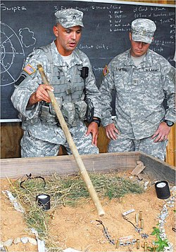

<div align="center">



# SANDKASTEN

**Open-source wargame simulation. NATO symbology. Real-world platform data. Continuous time or WeGo multiplayer. Fog of war. Community scenarios.**

*Named for the German military sand table used for operational planning.*


</div>

---

## What Is This?

A tactical wargame inspired by [Command: Modern Operations](https://www.matrixgames.com/game/command-modern-operations). You command naval and air forces on a tactical map against scripted opponents. Radar detection, anti-ship missiles, SAM defense, fog of war. The simulation runs in continuous time with pause/play/speed controls.

Sandkasten shares its map renderer and NATO symbology with [Auftragstaktik](https://github.com/lerugray/auftragstaktik), a tactical OSINT terminal. The long-term goal: pull real-world snapshots from Auftragstaktik as playable scenario starting positions.

### How It Differs From CMO

| | CMO | Sandkasten |
|---|---|---|
| **Cost** | $80+ | Free, open source |
| **Platform database** | Proprietary (CWDB) | Community-maintained, or import from CMO if you own it |
| **Scenario scripting** | Lua + complex editor | Visual trigger-condition-action system |
| **UI complexity** | Built for defense analysts | Built for players |
| **Multiplayer** | TCP/IP real-time | WeGo (simultaneous turns, planned) |
| **Real-world data** | None | OSINT snapshots via Auftragstaktik (planned) |

---

## Current State

**Phase 1 (Foundation)** is complete. You can run the app and see:

- Dark tactical map with NATO MIL-STD-2525 symbols
- A demo scenario (US carrier strike group vs. Iranian naval forces in the Strait of Hormuz)
- Click units to see detailed stats with tabbed Info/Sensors/Weapons panels
- Shift+click to pin range rings for multiple units
- Dark/light theme toggle
- Scenario editor at `/editor` — place units, set sides, save/load scenario JSON
- Full platform database API backed by 60k+ extracted CMO records

**Phase 2 (Simulation Core)** is also complete:

- Play mode at `/play` with real-time simulation
- Units move along waypoint paths with throttle control (loiter/cruise/full/flank)
- Radar detection with range-based probability and radar horizon
- ESM passive detection of active emitters
- Contact classification: Unknown, Detected, Classified, Tracked
- Fog of war: only see your own units and detected contacts
- Contacts age and degrade over time without sensor updates
- Time controls: pause/play, 1x-60x speed, sim clock display

**Phase 3 (OPFOR AI)** is complete:

- Doctrine system: ROE, engagement range, radar usage, evasion, withdrawal
- Mission types: patrol, strike, CAP, escort, transit
- Trigger-Condition-Action event scripting for dynamic scenario narratives
- Cascading doctrine: side → mission → unit overrides

**Phase 4 (Combat)** is complete:

- Anti-ship missile launch, flight, and intercept
- SAM defense and CIWS point defense
- Damage model: undamaged → damaged → mission-kill → destroyed
- Countermeasures: chaff, ECM, decoys
- Combat log with event history

**InfoWar Feed** (new):

- Era-appropriate media posts generated from in-game events via local LLM (Ollama)
- Personas: state media, wire services, OSINT accounts, pundits, civilians, troll farms
- Media channels adapt to scenario era: pre-1980s get radio/newspapers, 2020s+ get tweets/Telegram
- Requires [Ollama](https://ollama.com) running locally — game works fine without it
- "Media" sidebar tab with scrolling feed of generated posts

---

## Setup

**You need:** [Node.js 18+](https://nodejs.org) and [Git](https://git-scm.com).

```bash
git clone https://github.com/lerugray/sandkasten.git
cd sandkasten
npm install
npm run dev
```

Open `http://localhost:3000`.

### Platform Database (Optional)

The demo scenario works out of the box with a small built-in platform set. For the full database (4,700 ships, 7,100 aircraft, 4,200 weapons, 7,200 sensors), you need [Command: Modern Operations](https://store.steampowered.com/app/1076160/Command_Modern_Operations/) installed:

```bash
python scripts/extract_cmo_db.py
```

The script reads CMO's SQLite database files and outputs JSON to `data/extraction/`. The extracted data is gitignored since it's derived from proprietary game files.

---

## Tech Stack

- **Next.js 16** with TypeScript and Tailwind CSS
- **MapLibre GL JS** for the tactical map (dark Carto basemap)
- **milsymbol** for NATO MIL-STD-2525 symbol rendering
- **Python** for CMO database extraction (sqlite3, standard library only)

---

## Project Structure

```
sandkasten/
├── src/
│   ├── app/                    # Next.js pages (home, /play, /editor)
│   ├── components/
│   │   ├── map/                # TacticalMap, UnitLayer, RangeRings, DetailPanel
│   │   ├── game/               # Time controls, orders, intel, combat log
│   │   │   └── infowar/        # InfoWar feed UI (media cards, status)
│   │   └── editor/             # Scenario editor
│   ├── lib/
│   │   ├── map/                # Basemap styles, range ring geometry
│   │   ├── symbols/            # milsymbol factory with caching
│   │   ├── platforms/          # Platform database lookup
│   │   ├── scenarios/          # Scenario loader, demo scenario
│   │   ├── simulation/         # Sim engine, movement, detection, combat
│   │   ├── ai/                 # OPFOR doctrine, missions, TCA events
│   │   └── infowar/            # InfoWar engine, Ollama service, personas
│   └── types/                  # TypeScript interfaces
├── scripts/
│   └── extract_cmo_db.py       # CMO database extraction
├── data/                       # Extracted platform data (gitignored)
├── GDD.md                      # Game Design Document
├── TASKS.md                    # Development task breakdown
├── DB_EXTRACTION_SPEC.md       # CMO database schema reference
└── SESSION_NOTES.md            # Development log
```

---

## Development Roadmap

| Phase | Focus | Status |
|-------|-------|--------|
| **1. Foundation** | Project scaffold, map, NATO symbols, scenario editor | Complete |
| **2. Simulation Core** | Movement, radar detection, fog of war, time controls | Complete |
| **3. OPFOR AI** | Doctrine, missions (patrol/strike/CAP), TCA event scripting | Complete |
| **4. Combat** | Anti-ship missiles, SAM defense, damage model, countermeasures | Complete |
| **InfoWar Feed** | Era-appropriate media posts from game events via local LLM (Ollama) | Complete |
| **5. WeGo Multiplayer** | WebSocket sync, turn system, lobby, server-side fog of war | Planned |
| **6. Community** | Scenario sharing, Auftragstaktik OSINT import, campaign mode | Planned |

See [TASKS.md](TASKS.md) for the full breakdown and [GDD.md](GDD.md) for design details.

---

## Related

- **[Auftragstaktik](https://github.com/lerugray/auftragstaktik)** — Tactical OSINT terminal. Shares the map renderer and NATO symbology. Sandkasten will import its real-world data as scenario starting positions.

---

## License

MIT

---

*Built with [Claude Code](https://claude.ai/claude-code).*
